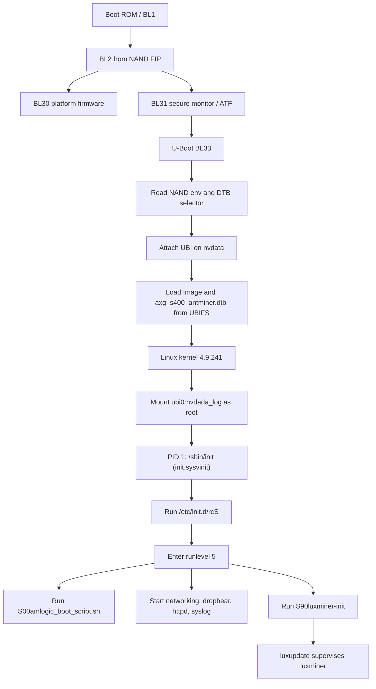

# Amlogic Control Board Boot Sequence

This document summarizes the observed firmware and software stack on the
Bitmain Amlogic control board used by this repository. It is based on:

- serial boot logs captured from the board console
- read-only U-Boot environment inspection
- read-only inspection of a live LuxOS-flashed board over SSH

The goal is to explain which component runs at each stage, where it is loaded
from, and how the board reaches the point where the tools in this repository
can be deployed and run.

## Scope and confidence

Some parts of the chain are directly observed from logs and environment
variables. Other parts are inferred from standard Amlogic AXG boot behavior.
This distinction matters.

- Directly observed:
  - NAND is the boot medium.
  - Early boot prints `BL1`, `BL2`, `BL31`, and then U-Boot.
  - U-Boot reads its environment and a DTB selector from NAND reserved areas.
  - LuxOS boots Linux by loading `Image` and `axg_s400_antminer.dtb` from UBIFS
    on the `nvdata` partition.
  - Linux mounts `ubi0:nvdada_log` as `/` and mounts the `config` partition as
    `/config`.
  - Userspace uses SysV init, not systemd as PID 1.
  - `luxminer-init` is the service hook that starts `luxupdate`, which in turn
    supervises `luxminer`.
- Inferred:
  - `BL1` is the immutable SoC boot ROM stage.
  - `BL2`, `BL30`, `BL31`, and U-Boot are packaged in the vendor boot chain in
    the NAND-resident firmware image.

## High-level flow



## Stage 1: SoC ROM and trusted firmware

The earliest visible serial messages are:

```text
AXG:BL1:...
BL2 Built : 10:38:43, Apr 14 2020
Load FIP HDR from NAND
Load BL3x from NAND
NOTICE: BL31: v1.3
NOTICE: BL31: AXG secure boot!
NOTICE: BL31: BL33 decompress pass
bl30:axg ver: 9 mode: 0
```

What that tells us:

- The board boots through the standard Amlogic AXG secure boot chain.
- NAND is the primary boot medium for the later boot stages.
- A firmware image package on NAND contains at least the pieces needed for
  `BL2`, `BL30`, `BL31`, and `BL33`.
- `BL33` is U-Boot.

What each stage is doing at a practical level:

- `BL1`: first-stage boot code in the SoC ROM. This is not something we modify
  from Linux.
- `BL2`: initializes DRAM and enough platform state to continue booting.
- `BL30`: low-level platform firmware used by Amlogic for housekeeping and
  power-management-related tasks.
- `BL31`: ARM Trusted Firmware secure monitor. It exposes PSCI services that
  Linux later uses for CPU bring-up.
- `BL33`: the normal-world bootloader, which is U-Boot on this board.

## Stage 2: U-Boot

The observed bootloader is:

```text
U-Boot 2015.01 (Jan 20 2022 - 16:59:33)
Build: jenkins-Antminer_BHB42XXX_AMLCtrl_factory-7
```

U-Boot discovers the NAND layout and reserved metadata areas before deciding
how to boot. Important observed facts:

- DRAM size: `256 MiB`
- NAND device: Micron `MT29F2G08-A` 2 Gib NAND
- reserved NAND regions include:
  - `nenv` for U-Boot environment
  - `ndtb` for DTB selection data
- the runtime board selector is `aml_dt=axg_s400_v03sbr`

### NAND layout used by U-Boot and Linux

Observed partition map:

```text
bootloader  0x000000000000-0x000000200000
tpl         0x000000800000-0x000001000000
misc        0x000001000000-0x000001200000
recovery    0x000001200000-0x000002200000
boot        0x000002200000-0x000004200000
config      0x000004200000-0x000004700000
nvdata      0x000004700000-0x000010000000
```

From the Linux side these appear as:

```text
mtd0  bootloader
mtd1  tpl
mtd2  misc
mtd3  recovery
mtd4  boot
mtd5  config
mtd6  nvdata
```

### Normal boot path in U-Boot

The critical environment variables are:

```text
bootcmd=run luxosboot || run storeboot

luxosboot=ubi part nvdata; ubifsmount ubi0:nvdada_log; \
  ubifsload ${ker_addr} Image; \
  ubifsload ${dtb_addr} axg_s400_antminer.dtb; \
  setenv bootargs "init=/sbin/init console=ttyS0,115200 \
  no_console_suspend earlycon=aml_uart,0xff803000 jtag=disable \
  root=ubi0:nvdada_log rootfstype=ubifs rw ubi.mtd=6,2048"; \
  booti ${ker_addr} - ${dtb_addr}
```

This means the normal LuxOS boot path is:

1. Attach UBI to NAND partition `nvdata`.
2. Mount UBIFS volume `ubi0:nvdada_log`.
3. Load the kernel image `Image` from that volume.
4. Load the Linux device tree `axg_s400_antminer.dtb` from that volume.
5. Construct the kernel command line.
6. Start the arm64 kernel with `booti`.

There are two DTB-related names to keep separate:

- U-Boot board selector: `axg_s400_v03sbr`
- Linux DTB filename loaded by LuxOS: `axg_s400_antminer.dtb`

That strongly suggests Bitmain or LuxOS adapted an S400/A113D reference board
lineage into an Antminer-specific Linux device tree.

### Recovery and update logic

U-Boot also contains recovery paths for USB, SD card, and flash recovery.
Those are controlled by variables such as:

- `update`
- `recovery_from_flash`
- `recovery_from_sdcard`
- `recovery_from_udisk`
- `upgrade_key`

The observed upgrade key check uses `GPIOAO_3`:

```text
upgrade_key=if gpio input GPIOAO_3; then echo detect upgrade key; run update;fi;
```

This is useful for understanding how vendor recovery is entered, but it is not
part of the normal LuxOS boot path.

## Stage 3: Linux kernel handoff

U-Boot eventually prints:

```text
Starting kernel ...
```

The observed Linux kernel is:

```text
Linux version 4.9.241-v2023.11.1-u0-58-g9f143660-g437dad4c-dirty
```

The command line passed by U-Boot is:

```text
init=/sbin/init console=ttyS0,115200 no_console_suspend \
earlycon=aml_uart,0xff803000 jtag=disable \
root=ubi0:nvdada_log rootfstype=ubifs rw ubi.mtd=6,2048
```

Important consequences of this command line:

- the Linux console stays on `ttyS0` at `115200`
- `ttyS0` is also the early boot console via `earlycon`
- the root filesystem is not an initramfs or ext4 block device
- the root filesystem is UBIFS on UBI device `ubi0`, volume `nvdada_log`
- PID 1 will be `/sbin/init`

The kernel then:

- brings up the AXG SoC peripherals
- probes the NAND controller and exports the MTD partitions
- attaches `ubi0` to `mtd6` (`nvdata`)
- mounts UBIFS volume `nvdada_log` as `/`
- later attaches `ubi1` to `mtd5` (`config`)
- mounts UBIFS volume `config_data` as `/config`

Observed mount state on a running board:

```text
ubi0:nvdada_log on / type ubifs
/dev/ubi1_0 on /config type ubifs
```

## Stage 4: Early userspace and init system

The running system is a SysV-init system:

```text
/sbin/init -> /sbin/init.sysvinit
```

The configured init flow is standard SysV:

- `/etc/inittab` sets default runlevel `5`
- the sysinit stage runs `/etc/init.d/rcS`
- `rcS` executes all scripts in `/etc/rcS.d/`
- init then enters runlevel `5` and executes `/etc/init.d/rc 5`
- a `getty` is spawned on `ttyS0`

That means the control board is not hiding boot policy inside a custom PID 1.
Most policy is still inspectable in shell scripts and init links.

### Early init scripts

The observed `rcS.d` order includes:

- banner and sysfs setup
- generic filesystem mount handling
- `systemd-udevd` as the device manager
- boot logging
- volatile directory population
- hostname setup

Despite using `systemd-udevd`, the system itself is not a systemd boot.
`udevd` is only one service in a SysV-init environment.

## Stage 5: Board-specific LuxOS boot script

At runlevel 5, the earliest board-specific script is:

```text
/etc/rc5.d/S00amlogic_boot_script.sh
```

The observed script does the following:

- creates a tmpfs ramdisk at `/mnt/ramdisk`
- attaches UBI to NAND partition `mtd5` (`config`)
- mounts `/dev/ubi1_0` at `/config`
- exports GPIOs `447`, `448`, `449`, `450`, and `445`
- probes I2C buses 0 and 1 with `i2cdetect`

Those GPIOs match hardware that this repository uses:

- `445`: IP report button
- `447` to `450`: fan tachometer inputs

This is an important point in the stack: before the miner starts, LuxOS already
does some board bring-up and ensures the persistent config volume is mounted.

## Stage 6: Persistent configuration

The `/config` mount is the persistent writable configuration store that survives
across reboots and is separate from the root filesystem volume.

Observed contents include:

- `/config/network.conf`
- `/config/luxminer.toml`
- `/config/luxminer.conf.d/*.toml`
- `/config/cgminer.conf`
- `/config/passwd`
- `/config/shadow`

What this implies:

- networking configuration is not hardcoded into the rootfs
- miner behavior is largely controlled by TOML files under `/config`
- pool credentials and operating profile live in persistent config rather than
  only in the base image

Example observed network config:

```text
hostname=Antminer
dhcp=true
```

Example observed miner config structure:

- pool groups and pool URLs
- fan-control parameters
- temperature-control parameters
- hashboard tuning and profile parameters
- PSU-related settings in `psu.toml`

## Stage 7: Service startup and miner supervision

The observed runlevel 5 ordering includes these notable services:

- `S01networking`
- `S10dropbear`
- `S20busybox-httpd`
- `S20syslog`
- `S90luxminer-init`

That ordering tells us the miner starts late, after basic networking and remote
access are already available.

The miner init script is:

```text
/etc/init.d/luxminer-init
```

Its behavior is simple:

- it does not start `luxminer` directly
- instead it launches `luxupdate` with `watch /luxminer`
- `luxupdate` is therefore the first long-running miner-related process started
  by init
- `luxupdate` then supervises or relaunches the actual `/luxminer` binary

So the effective process chain is:

```text
SysV init -> luxminer-init -> luxupdate -> luxminer
```

This distinction matters when modifying a live board. Disabling `/luxminer`
alone is often not enough if `luxupdate` is still present and runnable.

## Where this repository fits into the stack

This repository does not replace any part of the vendor boot chain. It operates
after the board has already completed the boot sequence described above.

Typical workflow:

1. Flash or boot a working LuxOS image.
2. Let U-Boot and Linux bring up the board normally.
3. Reach the board over SSH.
4. Optionally disable `luxminer` and `luxupdate` so they do not interfere with
   direct hardware access.
5. Copy in one or more standalone binaries from this repository.
6. Use those binaries to probe or control GPIO, fans, PSU, I2C peripherals, or
   hashboard interfaces.

That is why the tools here are useful: they can validate hardware behavior
independently of the stock mining stack.

## Practical summary

If you want the short version, the board boots like this:

1. Amlogic ROM and trusted firmware boot from NAND.
2. U-Boot starts and reads environment and DTB selection data from NAND.
3. U-Boot mounts UBI on `nvdata` and loads the LuxOS kernel and Linux DTB from
   UBIFS volume `nvdada_log`.
4. Linux mounts `nvdada_log` as `/` and later mounts `config_data` as `/config`.
5. SysV init runs `rcS`, then enters runlevel 5.
6. Board-specific init mounts `/config`, exports a few GPIOs, and probes I2C.
7. Networking, SSH, HTTP, and logging services start.
8. `luxminer-init` launches `luxupdate`, which supervises `luxminer`.
9. At that point the stock mining appliance is fully up, and repo tools can be
   deployed if you want to take over selected hardware interfaces.

## Known caveats

- The live board used during inspection had `/luxminer` and `/luxupdate`
  replaced with `/bin/false` for experimentation, so observed miner startup
  failures in some logs are expected in that modified state.
- The exact internal contents of the vendor FIP image were not unpacked here;
  the document is limited to what is visible from serial output and runtime
  inspection.
- The Linux device tree file used by LuxOS is `axg_s400_antminer.dtb`, while
  U-Boot internally identifies the board as `axg_s400_v03sbr`. Both names are
  real and refer to different points in the boot flow.
